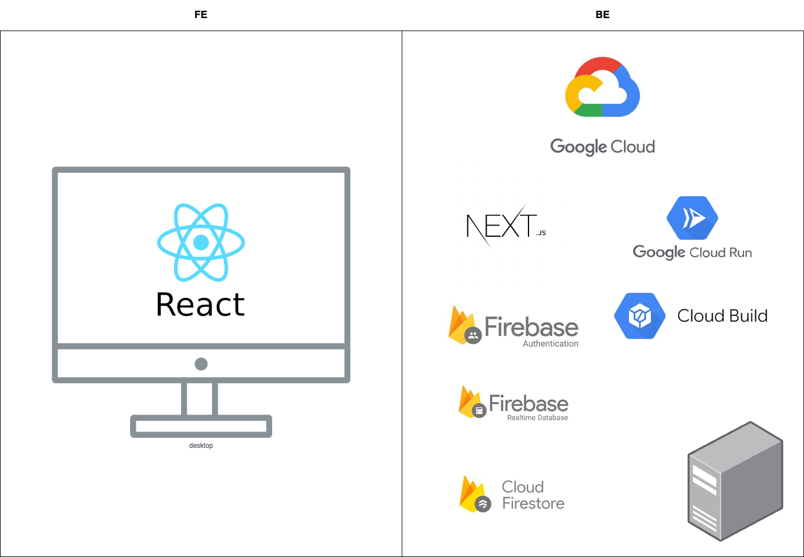

# Carbon Hero: Save The Earth
>This is a Solution for the people who don't know what actions could be taken to  
> reduce green house effect.   
>This is an education game. By playing this game, the players are informed  
> what could be done in real world to decrease the green house effect and  
> what contributes to the global warming and green house effect.  

## The team members
### GDSC CAU(Chungang University) students
- HoJoon Eum(GDSC Chungang University Lead)
- SeungYeon Lee(GDSC Chungang University Member)
- MinJu Jwa(GDSC Chungang University Member)

## The Problem Statement
Climate change has been a serious problem for a long time.
To deal with the problem, we should take Climate Actions which is 13th SDG.
But the actions are not being educated or informed well to most of the people. And the effective way to resolve this situation is not introduced definitely.
So we introduce this education game for global warming to all of the people, “The Carbon Hero”
This is a web game introducing global warming and the actions required, and the visualized green house effect.

## The Solution
### Target SDG
- 13 Climate Actions
- 13.3
  Improve education, awareness-raising and human and institutional capacity on climate change mitigation, adaptation, impact reduction and early warning

### The target group or Users
The people who don't know what climate actions could be taken  
to decrease green house effect and climate changes.  
From children to elders.

## The High Level Components

### How it works?
This is a web game for desktop users.  
The web page is supported by SSR(Server Side Rendering),   
and it is served by Google Cloud Run.  
The Web application is built with React.js and Next.js.  
The user data are stored in Realtime Database on Firebase. 
The static files such as images are stored in Firestore on Firebase.  

### The main features
This solution has 2 main features.
1. Visualizing Green House Effect affected by user interaction on 3D Globe.
2. Providing the components of Green House Effect based on the real measurement to the people who don't know about Green House Effect. 

The players can see the result of their actions right away. The result is represented with colors varied in 10 levels from
red to green. Also they can check the contribution of each actions to the green house effect.
And the players can see what green house gas is composing and contributing to the green house effect.
Each measurement of green house gases are based on real measurement data(2021). 
The commitment of each green house gases are also calculated based on the real factors of the green house effect.  
The details about actions are based on the real actions people can take.

### How Users interact with the solution
Users can interact with this solution by User Interface on the desktop viewport.  
For now, this game does not support mobile sized viewports.  
Players can take actions by buttons and icons.  
Players can check out how to play this game with modal providing help messages.  
Players can see the visualized green house effect measurement on the globe in the center.  
They can also rotate the globe to look over the countries affected by green house effect.

### How our solution uses Google Products and platforms
This is the list of Google Products used in this solution.
- Realtime Database
- Firestore
- Firebase Authentication
- Google Cloud Build
- Google Cloud Run

We used Firestore and Realtime Database for our products.
We store the user data for game in the Realtime Database.  
Web store the static files such as images for items in the Firestore.
We used firebase authentication with Google Provider.  

The web application is served by Google Cloud Run.  
The application is built using Google Cloud Build.

### What values are provided to users or target groups
This solution targets people who don't know what is Climate Change, especially the global warming due to green house effect.  
This solution provides them the information about Green House Effect.  
Each of the information are based on real facts about the Green House Effect.  
And the actions provided includes personal, enterprise, and national actions.  
So, the users will get informed naturally while playing game about what they could do daily, 
what enterprises could do, and what the government could do to decrease the Green House Effect.  

# How To Run this Code
Although this solution is deployed on web,  
but if you want to run it by yourself on your local machine, please follow the instructions below.
Before start, please install node.js, npm and yarn on your machine.  
1. clone this repository
2. run "yarn add" on your terminal(Make sure to be in the root directory of this project in CLI)
3. With no error, run "yarn dev" to serve in dev mode.
4. If you want to work with production mode, please run "yarn build" and "yarn start".
5. You can see the application running on "localhost:3000"